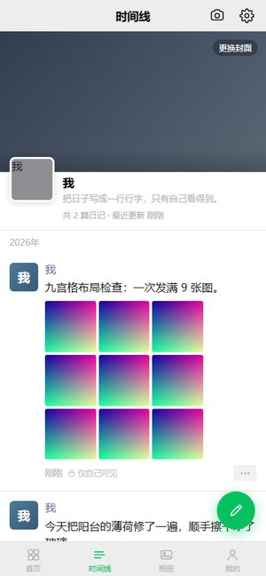
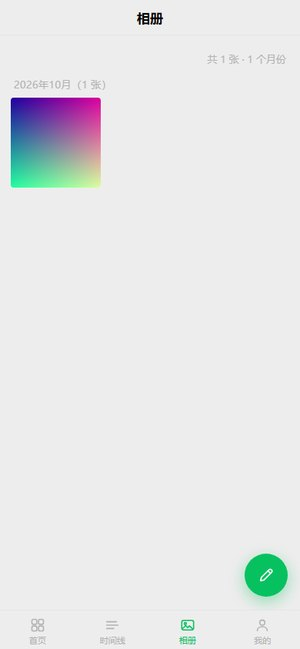
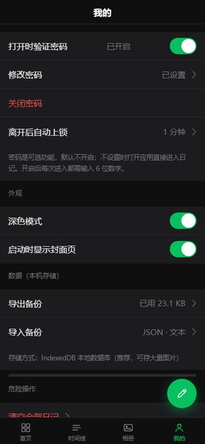
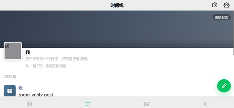

# 我的日记

一个仿微信朋友圈的私人日记应用。数据只存在你自己的设备上，不上传任何服务器。

也可以打包成 Android / iOS (release目前只有安卓安装包)安装包使用（见 [`mobile/`](mobile/)）。

---

## 界面预览

<table>
<tr>
<td align="center"><br><sub>时间线 · 朋友圈式信息流</sub></td>
<td align="center"><br><sub>九宫格配图</sub></td>
<td align="center"><br><sub>正文超 6 行折叠，点「更多」展开</sub></td>
</tr>
<tr>
<td align="center"><br><sub>大图查看器 · 双指缩放</sub></td>
<td align="center"><br><sub>相册 · 按月汇总</sub></td>
<td align="center"><br><sub>深色模式</sub></td>
</tr>
</table>

<p align="center">
<br>
<sub>手机横屏适配</sub>
</p>

## 为什么是单文件

- **不用装任何东西**：下载 `index.html`，双击，浏览器里就能写。
- **没有供应链**：页面里 **0 处外部链接**（无 CDN、无字体、无统计脚本）。
  断网可用，也不会因为某个 CDN 挂掉而变白屏。
- **数据在你自己手里**：文字与图片都存在浏览器本地（IndexedDB，不可用时自动降级到
  localStorage 再到内存）。没有账号、没有云端、没有遥测。
- **好归档**：一个文件就是整个应用，拷到 U 盘、发给自己、几年后再打开都还能用。

## 功能

| 功能 | 说明 |
|---|---|
| 时间线 | 朋友圈式信息流；正文超过 6 行折叠，点「更多」展开（行数按**真实视觉行数**计算） |
| 发日记 | 最多 9 张配图，图片自动压缩（最长边 1600px、JPEG 质量 0.82）后入库 |
| 拍照 | App 内可直接调用相机，照片**同时写入手机系统相册** |
| 看大图 | 双指捏合 / 滚轮 / 双击缩放，放大后可拖动平移；多图可左右滑动翻页 |
| 相册 | 全部图片按月份汇总 |
| 搜索 | 按文字内容搜索日记 |
| 统计 | 记录天数、字数、图片数、连续记录等（只在本机计算） |
| 密码锁 | 可选的 6 位 PIN；离开后自动上锁 |
| 深色模式 | 跟随设置切换，App 内状态栏也会跟着变 |
| 备份 | 导出 / 导入 JSON（含图片，可原样恢复）、纯文本、Markdown |
| 响应式 | 手机底部标签栏 → 平板居中单列 → 桌面左侧导航栏；**手机横屏单独适配** |

## 使用

**③ 安卓安装包** —— 不想自己打包就用现成的：

请在release中下载

> 这是正式签名包（release）。首次安装需要在系统设置里允许「安装未知来源应用」。
> 想自己编译也可以，见下面的「打包成手机安装包」。

## 打包成手机安装包

需要 Node.js >= 22。详细步骤（含 Android SDK 一次性准备、iOS 出包路线、
常见报错对照）见 **[`mobile/README.md`](mobile/README.md)**。

```bash
cd mobile
npm install          # 首次必须执行（依赖里有原生插件）
npm run apk:debug    # 生成调试包
npm run apk:release  # 生成正式包（首次会自动生成签名证书）
```

产物在 `mobile/android/app/build/outputs/apk/`。也可以直接双击 `mobile/build-apk.bat`。

> ⚠️ **签名证书请自己备份**：`npm run apk:release` 首次会生成
> `mobile/android/diary-release.keystore` 与 `keystore.properties`（含明文密码）。
> 这两个文件已被 `.gitignore` 排除，**永远不要提交**；同时请务必备份到别处 ——
> 以后给同一个包名发更新必须用同一份证书，丢了就再也覆盖安装不上。

## 数据与隐私

- 所有数据保存在浏览器 / App 的本地存储中，**没有云端同步**。
- 日记文字与图片都不会离开设备；「统计」也只在本机计算。
- 换设备前请先在应用内**导出备份**（JSON 含图片），再到新设备**导入备份**。
- 忘记 PIN 无法找回（本地哈希存储），只能清空数据重来 —— 所以请定期导出备份。

## 项目结构

```
index.html              # 网页版全部源码（唯一源文件，样式 + 结构 + 逻辑都在里面）
mobile/                 # Capacitor 移动端外壳（Android / iOS）
  sync.mjs              # 把 ../index.html 同步进 www/
  setup-android.mjs     # 一键配置 Android 环境并出包
  tools/preflight.mjs   # 打包前置静态体检
  android/  ios/        # 原生工程
_verify/                # 自动化验证脚本与界面截图
```

**注意**：`index.html` 是唯一源文件。`mobile/www/index.html` 与原生工程里的
`assets/public/index.html` 都是自动生成的副本，**不要手动改**（改了会被 `sync.mjs` 覆盖）。

## 自动化验证

项目里的功能都有对应的浏览器回归脚本，共 **582 项断言**，不需要真机：

```bash
cd _verify
node e2e_diary.mjs           # 344 项：网页版全量回归（需先另开终端 node serve.cjs）
node verify_close_pin.mjs    #  89 项：密码锁的关闭 / 修改流程
node native_shell.mjs        #  36 项：注入假原生桥，验证返回键 / 原生导出 / 状态栏
node verify_zoom_rotate.mjs  #  36 项：照片缩放 / 横屏适配 / 拍照回退
node file_boot.mjs           #  25 项：file:// 双击 + 存储降级
node verify_camera.mjs       #  20 项：拍照入草稿（注入假原生桥，跑真机才走的分支）
node verify_swipe.mjs        #  18 项：多图查看器的连续翻页（真实触摸事件）
node verify_fold.mjs         #  14 项：「更多 / 收起」的折叠判定
```

这些脚本积累了几个**真实踩过的坑**，都写在了注释里（`overflow:hidden` 会让被平移的
轮播子树失去命中测试、`addImages` 曾不返回 Promise、折叠判定曾把逻辑行当视觉行……）。
改代码前建议先读一遍，改完跑一遍。

## 浏览器支持

Chrome / Edge / Safari / Firefox 的现代版本，以及 Android WebView、iOS WKWebView。
依赖 IndexedDB（不可用时自动降级）与 Canvas（用于图片压缩）。

## 许可

[MIT](LICENSE) —— 随便用、改、再分发，保留版权声明即可。
